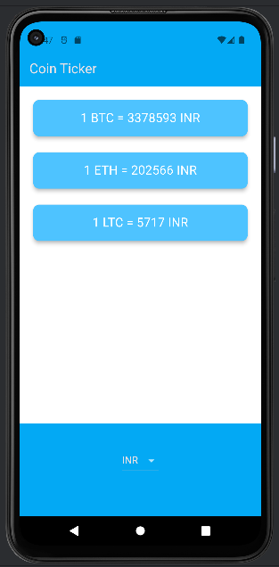

# Coin Ticker App

A simple Flutter app that fetches real-time cryptocurrency prices in various currencies. Users can select a preferred currency and view the exchange rates for popular cryptocurrencies.

## Features

- **Currency Selection:** Choose from a list of supported currencies to view cryptocurrency prices.
- **Real-time Data:** Fetches the latest cryptocurrency prices using the CoinAPI.
- **Interactive UI:** User-friendly interface displaying cryptocurrency prices for selected currencies.




*Caption: App Screenshot - The app displays real-time cryptocurrency prices based on the selected currency.*

## Getting Started

To run this app locally, follow these steps:

1. Clone this repository:
   ```bash
   git clone https://github.com/kshubham767/Coin_Ticker_App.git
   
2. Navigate to the project directory:
    ```bash
   cd Coin_Ticker_App

3. Install dependencies:
    ```bash
    flutter pub get
4. Get API Key:
- Sign up for a free account on CoinAPI.
- Obtain an API key and replace dotenv.env['COIN_API_KEY']! in coin_data.dart with your actual API key.  

5. Run the app:
    ```bash
    flutter run

## Dependencies
This project uses the following Flutter packages:
- http: A package for making HTTP requests.
- flutter_dotenv: A package for loading environment variables from a .env file in a Flutter project.

## CoinAPI
The app relies on the CoinAPI to fetch real-time cryptocurrency prices. You need to sign up for an account and replace dotenv.env['COIN_API_KEY']! in coin_data.dart with your actual CoinAPI key.

## Contributing
If you'd like to contribute to the development of the Coin Ticker App, feel free to:

- Submit pull requests
- Open issues on the GitHub repository

## License
This project is licensed under the MIT License. See the [LICENSE](https://opensource.org/licenses/MIT) file for details.

## Contact
For any questions or feedback, please contact the project maintainer at kshubham767@gmail.com.
